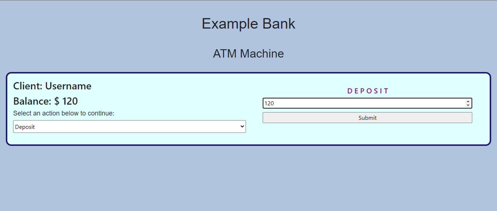

<div align="center" id="top"> 
  
  &#xa0;
</div>

<h1 align="center">ATM</h1>

<p align="center">
  

  

  

  
</p>

<p align="center">
  <a href="#dart-description">Description</a> &#xa0; | &#xa0; 
  <a href="#sparkles-roadmap">Roadmap</a> &#xa0; | &#xa0;
  <a href="#white_check_mark-requirements">Requirements</a> &#xa0; | &#xa0;
  <a href="#checkered_flag-starting">Starting</a> &#xa0; | &#xa0;
  <a href="#wrench-support">Support</a> &#xa0; | &#xa0;
  <a href="#memo-license">License</a> &#xa0; | &#xa0;
  <a href="https://github.com/AlexisCastro12" target="_blank">Author</a>
</p>

<br>

## :dart: Description

This project tries to simulate an ATM with two basic operations: Cash Back and Deposit through a UI with logic implemented with JS in React.

## :sparkles: Roadmap

The characteristics that this project currently has are:

:heavy_check_mark: You can deposit any amount of money to an example bank account.

:heavy_check_mark: You can make a cash back without producing a negative balance in the example bank account.

:heavy_check_mark: You can monitor the balance of the example bank account

:heavy_check_mark: You can enable or disable the available banking operations

## :white_check_mark: Requirements

Before starting :checkered_flag:, you need to have [Git](https://git-scm.com) installed.

## :checkered_flag: Starting

```bash
# Clone this project
$ git clone https://github.com/AlexisCastro12/ATM.git

```

Find the folder in the path where the clone was made, open the './index.html' file in any browser (Chrome recommended) and try it!

To enable the operations, select one of those available in the dropdown control. Then, enter the desired amount to withdraw or deposit in the input control and apply the movement through the submit button. The balance will be updated instantly!

Please note that any withdrawal attempt of an amount greater than the amount available in the sample account will be blocked

## :wrench: Support

If you have problems with the project or need additional information, please contact me at <alexis1204.aacs@gmail.com> :e-mail:.

## :memo: License

This project is under license from MIT. For more details, see the [LICENSE](LICENSE) file.

Made with :heart: by <a href="https://github.com/AlexisCastro12" target="_blank">AlexisCastro12</a>

&#xa0;

<a href="#top">Back to top</a>
